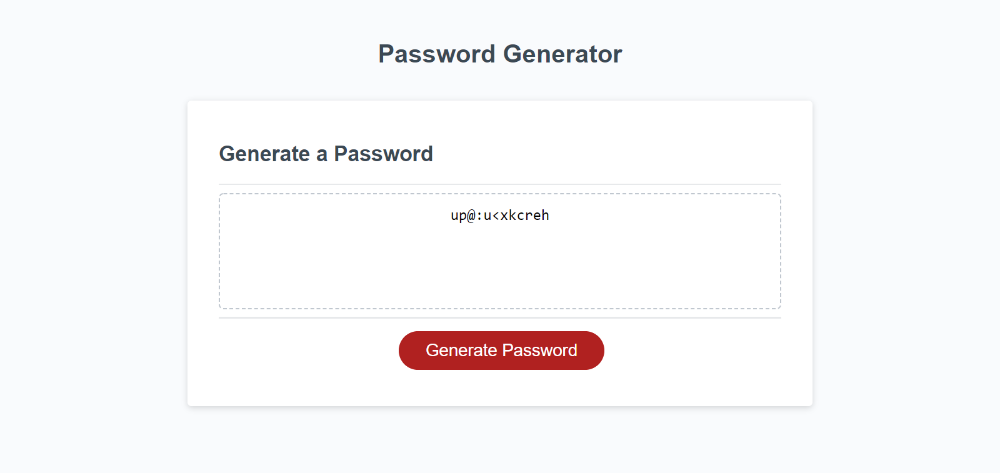

# Challenge-3
Module 3 Challenge: Password Generator
by Sergey Holin

GitHub Repo Link: https://github.com/sergeyholin/Challenge-3

Live Application Link: https://sergeyholin.github.io/Challenge-3/

1) ACCEPTANCE CRITERIA:

GIVEN I need a new, secure password
WHEN I click the button to generate a password
THEN I am presented with a series of prompts for password criteria
WHEN prompted for password criteria
THEN I select which criteria to include in the password
WHEN prompted for the length of the password
THEN I choose a length of at least 8 characters and no more than 128 characters
WHEN asked for character types to include in the password
THEN I confirm whether or not to include lowercase, uppercase, numeric, and/or special characters
WHEN I answer each prompt
THEN my input should be validated and at least one character type should be selected
WHEN all prompts are answered
THEN a password is generated that matches the selected criteria
WHEN the password is generated
THEN the password is either displayed in an alert or written to the page

2) ADDITIONAL CRITERIA:

Application deployed at live URL.

3) SOURCES:

A) Two pieces of my code (Lines 20-25 & 114-117) were ispired by a code i found on stackoverflow. The author (Amit Joki) produced a code as a solution to a question on how to save prompt input into array.
Link: https://stackoverflow.com/questions/28252888/javascript-how-to-save-prompt-input-into-array

B) I also borrowed a pice of code from CSS Tricks by Chris Coyier on how to select random item from an array (Line 116).
Link: https://css-tricks.com/snippets/javascript/select-random-item-array/

4) SCREENSHOT:

